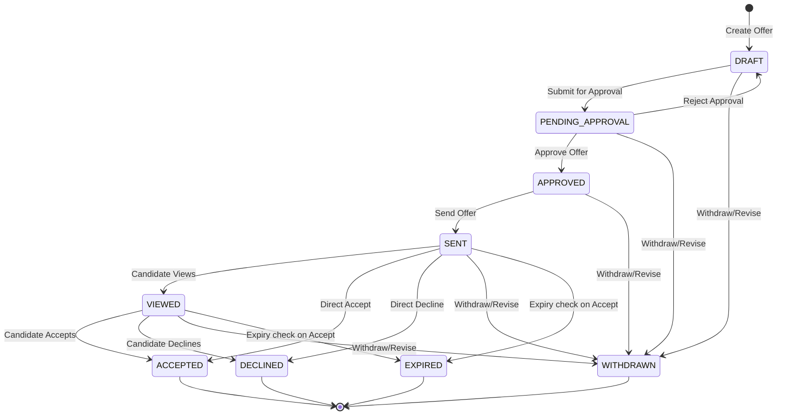

# Offers Module

The **Offers Module** handles the complete employment offer lifecycle from draft creation, approval workflows, candidate delivery, tracking decision states (acceptance, rejection), through revisions, expiration, and soft deletions.

---

## 1. Architecture

Follows the standard HireStack ATS multi-tier architecture:

```
[ HTTP Requests ] -> [ Routes ] -> [ Controllers ] -> [ Services ] -> [ Repositories ] -> [ Prisma Client ] -> [ PostgreSQL ]
                                                          |
                                                          v
                                                  [ Business Rules ]
                                                          |
                                                          v
                                                    [ Event Hooks ]
```

- **Routes**: Define HTTP endpoints, map routes to controller actions, and enforce authentication, authorization (RBAC), and company isolation.
- **Controllers**: Handle request payload validation, route execution, status code mapping, and response serialization.
- **Services**: Coordinate operations, execute multi-query operations inside single transaction boundaries, execute domain hooks, and handle logging.
- **Business Rules**: Extracted logic verifying company ownership, draft states, edit permissions, application eligibility, and date constraints.
- **Event Hooks**: Decoupled stubs that fire after successful transactions to integrate with downstream systems.
- **Repositories**: Execute database queries using reusable Prisma select blocks, custom filters, pagination, sorting, and optimistic row locking.

---

## 2. Folder Structure

```
offers/
├── constants/
│   └── offer.constants.ts       # Shared constants, status messages, transition rules
├── controllers/
│   └── offer.controller.ts      # HTTP Controllers
├── repositories/
│   └── offer.repository.ts      # Reusable query builders, transactions, DTO mapping, row locks
├── routes/
│   └── offer.routes.ts          # Express Router definition, RBAC protection
├── services/
│   ├── business-rules/
│   │   └── offer-rules.ts       # Extracted validation helpers and domain assertions
│   ├── helpers/                 # Generic internal service helpers
│   ├── offer.hooks.ts           # Domain Event Hooks (OnCreated, OnSent, etc.)
│   ├── offer.service.ts         # Service orchestration layer
│   └── offer.state-machine.ts   # Centralized status transition state machine
├── types/
│   ├── offer.dto.ts             # Strict mapping from database queries to DTOs
│   └── offer.types.ts           # Shared TypeScript types and interfaces
└── validation/
    ├── createOffer.schema.ts    # Zod payload schema for offer creations
    ├── index.ts                 # Export entrypoint
    ├── queryOffers.schema.ts    # Zod query parameters schema for listing offers
    └── updateOffer.schema.ts    # Zod payload schema for updating offers
```

---

## 3. Offer Lifecycle & Status Transitions

The status transitions of an Offer are governed by a strict transition matrix:



### Transition Rule Table

| Current Status      | Target Status      | Performed By     | Description                                        |
| :------------------ | :----------------- | :--------------- | :------------------------------------------------- |
| `DRAFT`             | `PENDING_APPROVAL` | Recruiter, Admin | Submit draft for internal review                   |
| `PENDING_APPROVAL`  | `APPROVED`         | Company Admin    | Offer details reviewed and accepted                |
| `PENDING_APPROVAL`  | `DRAFT`            | Company Admin    | Offer rejected during review; returned to draft    |
| `APPROVED`          | `SENT`             | Company Admin    | Email sent out containing offer details            |
| `SENT`              | `VIEWED`           | Candidate        | Candidate opens the offer page                     |
| `SENT`/`VIEWED`     | `ACCEPTED`         | Candidate        | Candidate accepts the terms                        |
| `SENT`/`VIEWED`     | `DECLINED`         | Candidate        | Candidate declines the terms                       |
| `DRAFT` to `VIEWED` | `WITHDRAWN`        | Company Admin    | Offer is recalled or superseded by revision        |
| `SENT`/`VIEWED`     | `EXPIRED`          | System (Dynamic) | Triggered when candidate accepts past `expiryDate` |

---

## 4. Permission Matrix (RBAC)

All endpoints enforce tenant isolation (`companyId`) and strict Role-Based Access Control (RBAC):

| Action         | API Route            | Super Admin | Company Admin |    Recruiter    | Candidate |
| :------------- | :------------------- | :---------: | :-----------: | :-------------: | :-------: |
| Create Offer   | `POST /`             |     ❌      |    Allowed    | Allowed (Owned) |    ❌     |
| Update Draft   | `PATCH /:id`         |     ❌      |    Allowed    | Allowed (Owned) |    ❌     |
| Submit Review  | `POST /:id/submit`   |     ❌      |    Allowed    | Allowed (Owned) |    ❌     |
| Approve Offer  | `POST /:id/approve`  |     ❌      |    Allowed    |       ❌        |    ❌     |
| Send Offer     | `POST /:id/send`     |     ❌      |    Allowed    |       ❌        |    ❌     |
| View Offer     | `POST /:id/view`     |     ❌      |    Allowed    |     Allowed     |  Allowed  |
| Accept Offer   | `POST /:id/accept`   |     ❌      |    Allowed    |     Allowed     |  Allowed  |
| Decline Offer  | `POST /:id/decline`  |     ❌      |    Allowed    |     Allowed     |  Allowed  |
| Withdraw Offer | `POST /:id/withdraw` |     ❌      |    Allowed    |       ❌        |    ❌     |
| Revise Offer   | `POST /:id/revision` |     ❌      |    Allowed    | Allowed (Owned) |    ❌     |
| Soft Delete    | `DELETE /:id`        |     ❌      |    Allowed    |       ❌        |    ❌     |
| List Offers    | `GET /`              |     ❌      |    Allowed    |     Allowed     |    ❌     |
| Get by ID      | `GET /:id`           |     ❌      |    Allowed    |     Allowed     |    ❌     |

- **Allowed (Owned)**: Recruiters can only modify offers they created or if they are the primary assigned Recruiter on the candidate's `Application`.
- **Candidate access**: Candidates are authenticated users associated with the `candidateId` of the specific offer.

---

## 5. Business Rules

1. **Company Isolation:** Offers cannot be queried, modified, or listed across different company schemas. Tenant boundaries are strictly validated on every write and read operation.
2. **Active Application Constraint:** Offers can only be created for applications that are currently `ACTIVE`. Offers cannot be processed for rejected, withdrawn, or completed applications.
3. **Single Active Offer:** An application can only have one active offer (`DRAFT`, `PENDING_APPROVAL`, `APPROVED`, `SENT`, `VIEWED`) at any given time to avoid conflict states.
4. **Draft Immutability Bounds:** Once submitted for approval, the offer details (salary, currency, dates, letter attachments) are immutable. Changes require creating a new revision.
5. **No Parameter Poisoning:** Fields such as `companyId`, `offerCode`, `candidateId`, `applicationId`, and `version` are immutable and protected during updates.
6. **Date Bounds Verification:**
   - `joiningDate` must start on or after the current calendar date.
   - `expiryDate` must occur after the current calendar date and strictly before the `joiningDate`.
7. **Expiry enforcement:** If a candidate attempts to accept an offer after the `expiryDate`, the system dynamically flags the offer status as `EXPIRED` and blocks acceptance.
8. **Offer Deletion Rule:** Offers can be soft-deleted only if they have not reached `ACCEPTED` status. Accepted offers are legally binding and permanent.

---

## 6. API Endpoints & Validation Rules

### Offer Creation

- **Endpoint:** `POST /api/v1/offers`
- **Body Validation:**
  - `applicationId`: UUID (Required)
  - `salary`: Positive Number (Required)
  - `currency`: Enum `USD` \| `INR` \| `EUR` \| `GBP` (Required)
  - `employmentType`: Enum `FULL_TIME` \| `PART_TIME` \| `CONTRACT` \| `INTERN` (Required)
  - `joiningDate`: ISO Date String (Required)
  - `expiryDate`: ISO Date String (Required)
  - `benefits`: String (Optional, max 2000 chars)
  - `notes`: String (Optional, max 2000 chars)

### Offer Revision

- **Endpoint:** `POST /api/v1/offers/:id/revision`
- **Body Validation:** Same schema as Offer Creation.
- **Mechanism:** Acquires database row lock on the old version, creates a new version record (`version` increments, same `offerCode`), and marks the old version as `WITHDRAWN`.

---

## 7. Search, Filtering, and Pagination

The list endpoint `GET /api/v1/offers` integrates query parameter validations (`queryOffersSchema`) with optimized Prisma mapping:

- **Search:** Matches sub-string content against:
  - `offerCode` (e.g. `OFF-000001`)
  - `applicationCode`
  - Candidate details (`firstName`, `lastName`, `candidateCode`)
  - Job title (`title`)
  - Recruiter details (`name`, `firstName`, `lastName`)
- **Filtering:** Supports exact matching on:
  - `status`, `currency`, `employmentType`, `recruiterId`
  - Date ranges (calculated for start-of-day and end-of-day bounds) on `joiningDate`, `expiryDate`, `createdAt`
- **Pagination:** Handles pagination parameters (`page`, `limit`) mapping to database-level `skip` and `take` via `paginationHelper`.
- **Sorting:** Supports sorting on `createdAt`, `updatedAt`, `salary`, `joiningDate`, and `expiryDate`.

---

## 8. Future Integration Points

Decoupled domain event hook methods inside [offer.hooks.ts](file:///c:/Projects/HireStack/backend/src/modules/offers/services/offer.hooks.ts) provide ready-made extension points to integrate with:

- **Notifications Module:** Emits internal alerts to Company Admins when revisions are made or candidate actions occur.
- **Audit Logging Module:** Log operational timelines for legal compliance.
- **Hiring Pipeline / Application stage trigger:** Triggers application stage transition to `OFFER` or `HIRED` upon acceptance.
- **Email Service / SMS delivery:** Automated dispatch of offer letters via email once status transitions to `SENT`.
