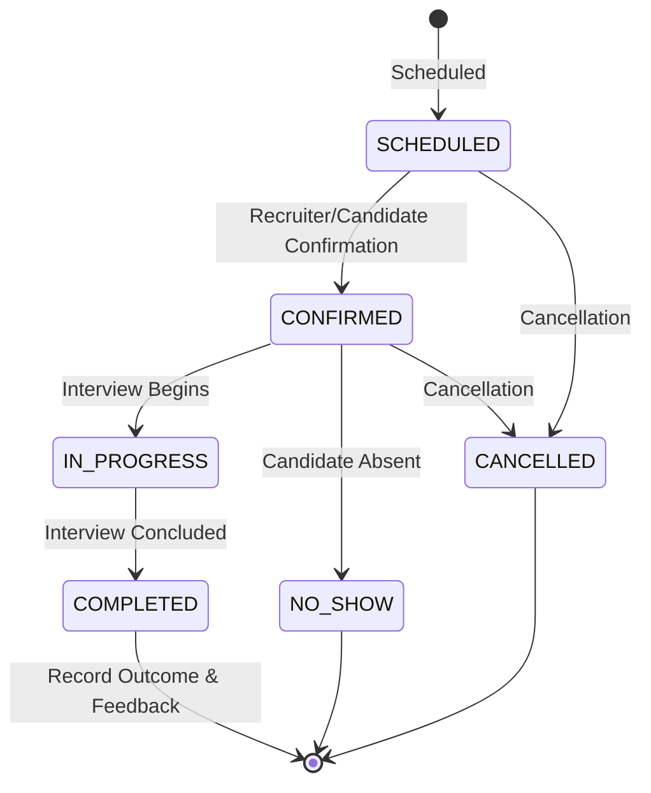

# Phase 3 — Stage 7E: Interviews Frontend Implementation

## 1. Interview Module Architecture

The **Interviews** module provides a production-grade interface for recruiting teams to schedule, coordinate, conduct, outcome, and manage candidate interviews in HireStack ATS.

The module connects the domain hierarchy:
```
Candidate
    ↓
Application
    ↓
Job
    ↓
Interview
```

### Directory Structure
```
src/features/interviews/
├── components/
│   ├── InterviewActions.tsx
│   ├── InterviewApplication.tsx
│   ├── InterviewCandidate.tsx
│   ├── InterviewFilters.tsx
│   ├── InterviewForm.tsx
│   ├── InterviewJob.tsx
│   ├── InterviewSchedule.tsx
│   ├── InterviewStatusBadge.tsx
│   ├── InterviewSummary.tsx
│   ├── InterviewTable.tsx
│   └── index.ts
├── hooks/
│   ├── interview-query-keys.ts
│   ├── useCreateInterview.ts
│   ├── useDeleteInterview.ts
│   ├── useInterview.ts
│   ├── useInterviewMutations.ts
│   ├── useInterviews.ts
│   ├── useUpdateInterview.ts
│   └── index.ts
├── pages/
│   ├── InterviewCreatePage.tsx
│   ├── InterviewDetailPage.tsx
│   ├── InterviewEditPage.tsx
│   ├── InterviewsPage.tsx
│   └── index.ts
├── services/
│   └── interviews.service.ts
├── types/
│   └── interviews.types.ts
├── utils/
│   └── interview-helpers.ts
└── index.ts
```

---

## 2. Exact Backend Endpoints

The module strictly interfaces with the authoritative Express routes and OpenAPI specs in `backend/src/modules/interviews/routes/interview.routes.ts`:

| Method | Endpoint | Description | Authorized Roles |
|---|---|---|---|
| `POST` | `/interviews` | Schedule new interview round | `COMPANY_ADMIN`, `RECRUITER` |
| `GET` | `/interviews` | List interviews with pagination, search, and filters | `COMPANY_ADMIN`, `RECRUITER` |
| `GET` | `/interviews/:id` | Get complete interview details by ID | `COMPANY_ADMIN`, `RECRUITER` |
| `PATCH` | `/interviews/:id` | Update delivery mode, meetingLink, location, notes | `COMPANY_ADMIN`, `RECRUITER` |
| `PATCH` | `/interviews/:id/status` | Transition interview status | `COMPANY_ADMIN`, `RECRUITER` |
| `PATCH` | `/interviews/:id/reschedule` | Reschedule interview date, time, and location/link | `COMPANY_ADMIN`, `RECRUITER` |
| `PATCH` | `/interviews/:id/outcome` | Record outcome and result notes (COMPLETED status) | `COMPANY_ADMIN`, `RECRUITER` |
| `PATCH` | `/interviews/:id/cancel` | Cancel interview with cancellation reason | `COMPANY_ADMIN`, `RECRUITER` |
| `PATCH` | `/interviews/:id/interviewers` | Assign or update interviewer user IDs | `COMPANY_ADMIN`, `RECRUITER` |
| `DELETE` | `/interviews/:id` | Soft-delete interview | `COMPANY_ADMIN` |

---

## 3. Request/Response Contracts

All API requests and responses are strongly typed in `interviews.types.ts`:

- **List Response Envelope**:
  ```ts
  interface InterviewListResponse {
    data: readonly Interview[]
    meta?: {
      total: number
      totalPages: number
      page: number
      limit: number
    }
  }
  ```
- **Schedule Request Body**:
  ```ts
  interface CreateInterviewInput {
    applicationId: string
    interviewType: InterviewType
    round: InterviewRound
    mode: InterviewMode
    scheduledDate: string // ISO Date
    startTime: string // ISO DateTime
    endTime: string // ISO DateTime
    timeZone: string
    meetingLink?: string
    location?: string
    notes?: string
    interviewers: readonly string[]
  }
  ```
- **Update Request Body**:
  ```ts
  interface UpdateInterviewInput {
    mode?: InterviewMode
    meetingLink?: string
    location?: string
    notes?: string
  }
  ```
- **Status Transition Body**:
  ```ts
  interface UpdateInterviewStatusInput {
    status: InterviewStatus
  }
  ```
- **Reschedule Request Body**:
  ```ts
  interface RescheduleInterviewInput {
    scheduledDate: string
    startTime: string
    endTime: string
    timeZone: string
    meetingLink?: string
    location?: string
    notes?: string
  }
  ```
- **Outcome Request Body**:
  ```ts
  interface RecordInterviewOutcomeInput {
    outcome: InterviewOutcome
    resultNotes?: string
  }
  ```
- **Cancel Request Body**:
  ```ts
  interface CancelInterviewInput {
    cancellationReason: string
  }
  ```
- **Assign Interviewers Body**:
  ```ts
  interface AssignInterviewersInput {
    interviewers: readonly string[]
  }
  ```

---

## 4. Interview Data Model

Enums matching backend Prisma definitions:
- **`InterviewStatus`**: `SCHEDULED`, `CONFIRMED`, `IN_PROGRESS`, `COMPLETED`, `CANCELLED`, `NO_SHOW`
- **`InterviewType`**: `INTERNAL`, `CLIENT`, `CAMPUS`, `WALK_IN`, `OTHER`
- **`InterviewRound`**: `SCREENING`, `TECHNICAL`, `MANAGERIAL`, `HR`, `FINAL`
- **`InterviewMode`**: `ONLINE`, `ONSITE`, `PHONE`
- **`InterviewOutcome`**: `PASS`, `FAIL`, `ON_HOLD`, `RECOMMENDED`, `STRONG_RECOMMEND`, `NOT_RECOMMENDED`

---

## 5. Interview State Machine

Enforced in frontend helper `getAllowedStatusTransitions` aligning with backend `STATUS_TRANSITION_RULES`:


Terminal statuses (`COMPLETED`, `CANCELLED`, `NO_SHOW`) lock immutable scheduling parameters.

---

## 6. Candidate, Application & Job Relationships

- **Candidate Link**: Renders candidate name and email; if valid ID exists, provides navigation to `/app/candidates/:candidateId`.
- **Application Link**: Displays application code, current stage, status, and assigned recruiter; links to `/app/applications/:applicationId`.
- **Job Link**: Displays requisition title and job code; links to `/app/jobs/:jobId`.
- Missing relations are gracefully handled without rendering broken links.

---

## 7. Date/Time Contract & Timezone Safety

- Scheduling requires explicit timezone string (`timeZone`, e.g., `Asia/Kolkata`, `America/New_York`, `UTC`).
- `scheduledDate`, `startTime`, and `endTime` are sent and stored as ISO datetime strings.
- Frontend formatters in `interview-helpers.ts` use `Intl.DateTimeFormat` with explicit timezone passing to prevent silent browser offset distortion.
- Duration is accurately calculated and displayed (e.g. `1 hr 30 mins`).

---

## 8. Search, Filters, Sorting & Pagination

- **Search**: Multi-entity backend search across `interviewCode`, candidate names, job titles, and interviewer names. Synchronized with URL query string.
- **Filters**: Status, Round, Type, Delivery Mode, and Outcome filters wrapped in `AtsFilterBar`.
- **Pagination**: Server-side pagination with `page` and `limit`.
- **Sorting**: Sort by `scheduledDate`, `startTime`, `createdAt`, `updatedAt`, `interviewType`, `round`, `status`.

---

## 9. RBAC & Security

- `COMPANY_ADMIN` and `RECRUITER` have full access to workspace interviews.
- Recruiters are scoped to their assigned applications per backend rules.
- `SUPER_ADMIN` platform users and `CANDIDATE` applicants are restricted from tenant-level interview manipulation routes.
- Destructive deletion (`DELETE /interviews/:id`) is exclusive to `COMPANY_ADMIN`.
- Company ID is strictly derived from backend authenticated JWT context, preventing cross-tenant access.

---

## 10. Cache Invalidation

TanStack Query invalidations:
- **Create**: Invalidates interview lists, applications lists, and pipeline boards.
- **Update**: Sets query data for detail and invalidates interview lists.
- **Status Change**: Sets query data, invalidates interview lists, applications, and pipeline.
- **Reschedule**: Sets query data and invalidates lists.
- **Record Outcome**: Sets query data and invalidates lists.
- **Cancel**: Sets query data and invalidates lists.
- **Delete**: Removes detail query and invalidates lists.
